## AttnGAN with noise suppression 

This repository is a fork from the implementation of 
[AttnGAN: Fine-Grained Text to Image Generation with Attentional Generative Adversarial Networks](http://openaccess.thecvf.com/content_cvpr_2018/papers/Xu_AttnGAN_Fine-Grained_Text_CVPR_2018_paper.pdf)

#### Problem:
Original implementation doesn't have any noise suppression algorithm, 
thus sentence and word feature vectors are exposed to noise in an input text.


#### Proposed solution:
In a paper [A Generative Adversarial Approach for Zero-Shot Learning from Noisy Texts](http://openaccess.thecvf.com/content_cvpr_2018/papers/Zhu_A_Generative_Adversarial_CVPR_2018_paper.pdf)
there was proposed an approach to handle noise in texts. In essence, the solution uses a fully-connected layer 
for an input vector which reduces its size (from 11083 to 1000). After this it adds some noise and scales to 4096 feature vector.

Basically, it works like an autoencoder with one hidden layer, which reduces noise in the input vector. 
So, the same idea was applied in this repo, in order to get better results with the original attentional GAN. 

Autoencoder was applied to the outputs of RNN-encoder in AttnGAN. It has word feature vectors and 
sentence feature vector - they represent features of the text, so we can try to reduce noise in them.

#### Solution

```
autoencoder= 
nn.Sequential(
    nn.Linear(nhidden, nhidden // 20),
    nn.LeakyReLU(),
    nn.Linear(nhidden // 20, nhidden),
    nn.Tanh())
```
`nhidden` - number of hidden output features of RNN-encoder.

The first attempt was to apply noise suppression to all outputs (word and sentence features as well, two different autoencoders),
but it caused to degradation in quality of picture details:

 Original solution |  Word and sentence autoencoder | Sentence autoencoder only
:-------------------------:|:-------------------------:|:-------------------------:
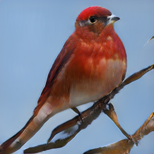 | 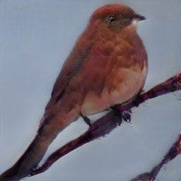 | 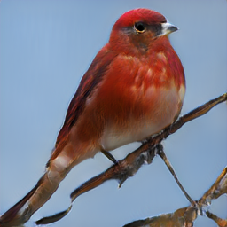

So, the final solution contains only sentence autoencoder.

Also, it has intuition behind this - sentence features are quite important, because they are used for generation
of the first low-scale image, and the final result depends on its quality and realism. And word features are used to generate more details of the image - 
and we want our image to have more visual features.

The suggested approach helped to get rid of the noise for some examples:

 Original | AE (25 hidden)  | AE (17 hidden) | AE (12 hidden) | AE (10 hidden)
:-------------------------:|:-------------------------:|:-------------------------:|:-------------------------:|:-------------------------:
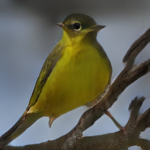 | 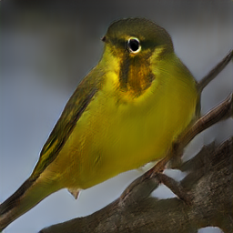 | 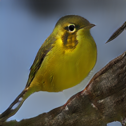 | 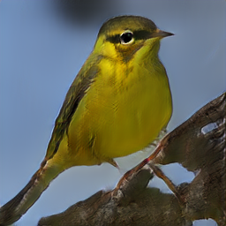 | 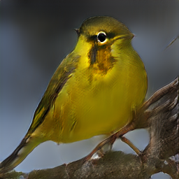

Autoencoder with 12 hidden features shows a good result here - bird doesn't have two beaks like in the original example. So, this architecture was trained for more epochs:

 Original | AE 
:-------------------------:|:-------------------------:
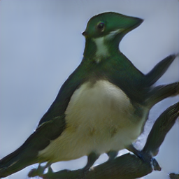 | 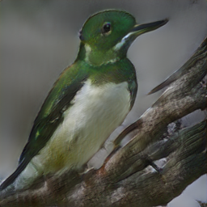 
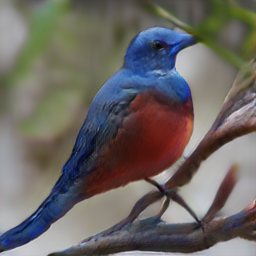 | 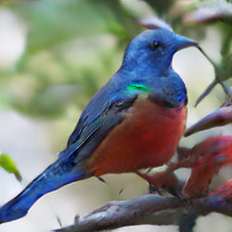 
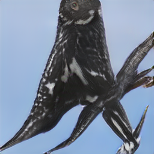 | 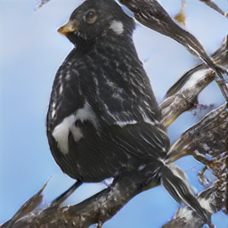 


#### Conclusion
Sentence autoencoder fixed some cases for which the original GAN generated non-relevant examples, but also in some cases 
it may reduce details of an image. 

So, there is space for further exploration.